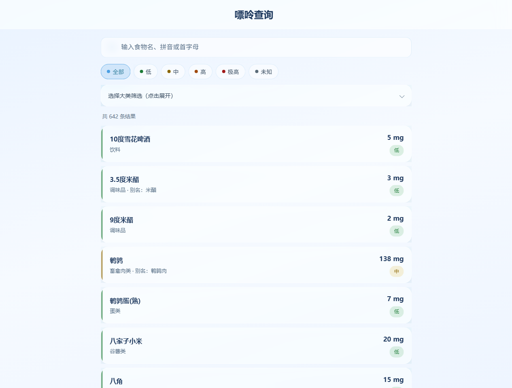
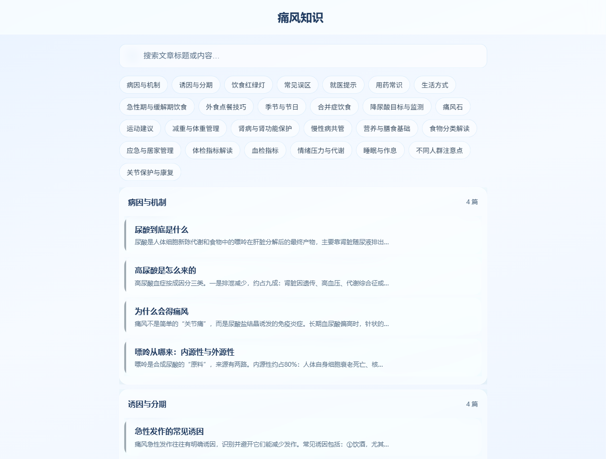
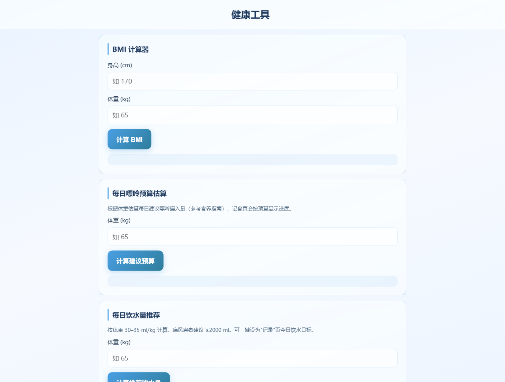
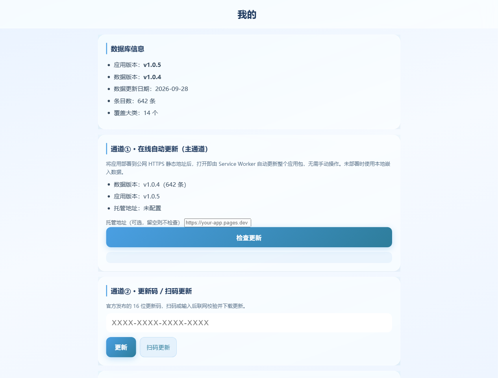

# 清透控酸 · 高尿酸血症 / 痛风饮食助手

> 纯前端、免费的高尿酸血症/痛风病友嘌呤查询与健康记录工具：Windows 桌面端(.exe) + 手机端 PWA，两端共用同一份权威可溯源嘌呤数据库（642条），液态玻璃 UI，支持三通道软更新（PWA自动 / 16位短码 / 离线包）。无后端、不收集任何用户数据。当前版本 v1.0.5。

## 项目简介

面向 **高尿酸血症与痛风人群** 的日常饮食与健康管理工具，完全免费、纯前端（无后端、无服务器、无账号），用户数据全部保存在本地设备。

- **电脑端（Windows）**：基础嘌呤查询 + 官方数据管理 + 一次性更新密钥生成。
- **手机端（PWA）**：功能丰富，可离线使用、可"添加到主屏幕"当 App 用。
- **数据一致**：两端读取**同一份**嘌呤数据库，保证查询结果完全一致。

## 界面预览（v1.0.5 液态玻璃 UI）

| 首页查询 | 知识库 | 工具箱 |
|---|---|---|
|  |  |  |

| 我的（三通道更新） | 食物详情 |
|---|---|
|  |  |

## v1.0.5 vs v1.0.4 版本对比

| 维度 | v1.0.4（旧版） | v1.0.5（新版） |
|---|---|---|
| UI 风格 | 绿色医疗风 | **液态玻璃 glassmorphism 浅淡蓝半透毛玻璃** |
| App 图标 | 绿色水滴+DNA | **浅蓝玻璃质感水滴+DNA+绿叶+餐盘** |
| 底部 Tab | 5 个 | **6 个（知识独立成页）** |
| 知识库 | 7 板块 23 篇，在"我的"里 | **26 板块 119 篇，独立 Tab，含血检指标/减重/肾病/慢性病等** |
| 知识库 UI | 简单列表 | **板块索引+搜索+分组卡片+文章详情** |
| 工具 | BMI+尿酸目标 | **+每日嘌呤预算+饮水量推荐+嘌呤等级速查表** |
| 更新通道② | 长 PUR- 密钥 | **16位短码+托管索引+两级HMAC+设备级一次性** |
| 数据+代码更新 | 仅数据 | **支持 typ=full 一体更新** |
| 扫码更新 | 扫完需手动点 | **扫码即自动更新** |
| 摄像头 | PWA独立窗口黑屏 | **修复（playsinline/muted）** |
| 字体 | 标准 | **全局适度放大** |
| 顶部标题 | 靠左贴边 | **居中放大** |
| 通道归类 | 长密钥混在通道② | **②=短码+扫码，③=离线长密钥** |
| 密钥安全 | 改末尾字符仍可用 | **往返校验+MAC+指纹去重，改字必拒** |
| 冗余 | 部分重叠 | **合并去重** |

## 示例更新码（v1.0.5 正式发布）

| 短码 | 二维码 | 说明 |
|---|---|---|
| `2VHT-KQSX-2LPE-AECF` |  | 数据+UI一体更新，有效期至2027-12-31 |
| `WNGU-J5BH-DKTB-L4KN` |  | 同上 |
| `J3PK-KQRX-U78M-X8F7` |  | 同上 |

> 手机端"我的 → 通道②"输入短码或扫码即可更新。设备级一次性，清数据后可再用。

## 功能特性

### 手机端（PWA，6 个 Tab，液态玻璃 UI）
- **查询**：中文 + 拼音全拼 + 首字母模糊搜索；嘌呤等级筛选（低/中/高/极高）；14 大类分类浏览；食物详情（嘌呤值、等级、来源、备注）。
- **记食**：每日嘌呤摄入估算，添加食物 + 克数自动计算，按日期存储，三档提示（安全 / 注意 / 超标）。
- **记录**：
  - 饮水统计：快捷加水、目标设置、进度条、近 7 天柱状图、提醒；
  - 尿酸记录：数值 / 日期 / 备注，历史列表；
  - 尿酸折线图：1 周 / 1 月 / 3 月 / 全部切换，含 360μmol/L 与 420μmol/L 参考线。
- **知识**：26 板块 119 篇健康科普（病因/饮食/减重/肾病/慢性病/血检指标/误区辟谣/生活方式等），支持搜索、板块分组、文章卡片浏览，逐篇标注权威来源。
- **工具**：BMI 计算 + 痛风风险提示、每日嘌呤预算计算器、饮水量推荐计算器、嘌呤等级速查表、尿酸目标参考。
- **我的**：版本信息（app版本+数据版本）、三通道更新、免责声明。

### 电脑端（Windows .exe，3 个 Tab）
- **嘌呤查询**：与手机端共用同一数据库与查询逻辑。
- **数据管理**：浏览 / 搜索 / 编辑 / 新增食物条目，保存为新版本 JSON（版本自动递增 + 导出）。
- **密钥生成器**：16位短码（通道②，含二维码+索引文件导出）、离线包（通道③），作为官方更新的签发方。

## 数据可信度

**原则：宁缺毋滥、严禁编造、每条数值可追溯。**

- 覆盖 **642 条**食物，14 大类，0 条未知，等级匹配零错配。
- 数据口径：mg/100g 可食部（生重，特殊标注除外）；等级分 低(<75) / 中(75–150) / 高(150–300) / 极高(>300)。
- 不同来源数值有出入时给出范围并标注"因来源而异"。

### 数据来源（8 项权威来源）
1. 《成人高尿酸血症与痛风食养指南（2024 年版）》· 国家卫生健康委
2. WS/T 560—2017《高尿酸血症与痛风患者膳食指导》
3. 《中国高尿酸血症与痛风诊疗指南（2019）》· 中华医学会风湿病学分会
4. 南方医科大学南方医院临床营养科《400 余种食物嘌呤含量表》
5. 上海市徐汇区卫健委《嘌呤食物一览表》
6. 广东省中医药局公开数据
7. USDA FoodData Central（国外权威数据，已翻译为中文入库）
8. 杨月欣《中国营养科学全书》第 2 版，人民卫生出版社

### 数据质量
- 独立验证：63 条抽样与 2024 指南原文逐行比对，58 条一致（92% 保真度），发现错误已修正。
- 全库复核：对全部条目逐条与权威资料交叉核对，修正冲突、合并重复，无编造数值。
- 知识库 26 板块 119 篇，均通过指南对照审核，逐篇标注权威来源（11 个权威来源），不给具体用药建议。

## 技术栈

- 纯前端：原生 HTML / CSS / JavaScript（单页应用，无框架依赖，便于离线与部署）
- PWA：Service Worker 离线缓存、Web App Manifest 可安装
- 桌面端：Electron 封装（NSIS 安装版 + 便携版 .exe）
- 图表：Canvas 原生绘制（无第三方图表库）
- 二维码 / 解码：qrcode.min.js / jsqr.js；压缩：pako.js

## 快速开始

### 电脑端
直接运行 `desktop/dist/` 下的便携版 `.exe`（双击即用），或运行 NSIS 安装版安装到系统。

### 手机端
1. 将 `web/` 目录下所有文件上传到任意 HTTPS 静态托管（GitHub Pages / Gitee Pages / 阿里云 OSS / 腾讯云 COS / Vercel / Netlify 等）。
2. 手机浏览器访问托管地址。
3. 浏览器菜单选择"添加到主屏幕"，即可像 App 一样全屏使用，支持离线。
   > PWA 与离线能力要求 HTTPS（localhost 除外），请确保托管地址为 HTTPS。

## 三通道更新机制

两端共用同一份数据库；软件更新走"三种通道"，边界清晰、如实说明：

1. **通道① · PWA 在线自动更新（主通道）**：将新版应用 + 数据库推送到托管地址后，用户打开即自动更新（Service Worker），无需任何操作。边界：需部署在公网 HTTPS 静态地址。
2. **通道② · 16位短码 / 二维码受控更新（辅通道，默认入口，需联网）**：桌面端生成 `XXXX-XXXX-XXXX-XXXX` 短码及对应索引文件 `keys/<sha256(码)[:16]>.json`；手机端输入短码或扫码 → 本地算文件名拉取索引 → 两级 HMAC-SHA256 验签 → 联网下载更新包 → 校验哈希 → 覆盖本地库/代码。支持 `typ=full`（数据+UI代码一体更新）。二维码/扫码属本通道。边界：二维码只承载16位码，不承载数据；需联网下载索引和更新包。
3. **通道③ · 离线自包含长密钥（兜底，完全离线可用）**：长 `PUR-…` 密钥内含 gzip 压缩的完整数据库，完全无网络也能更新。边界：密钥很长（约数万字符），仅适合复制粘贴，不适合二维码。

### 设备级一次性说明
- 通道②短码采用**设备级一次性**：`used_codes`（存sha256(码)）+ `used_types`（存版本指纹）两层去重，同一码本设备二次使用会被拒绝。
- **设备清除数据/重装后码可再用**（"设备初始化不算"）。
- 纯前端无后端，**跨设备全局一次性无法强制**；全局一次性需后端服务支持。主通道① PWA 自动更新仍是推荐的主方案。

## 目录结构

```
purine-app/
├─ data/           # 唯一数据源：purine-db.json / xlsx / pinyin-map / knowledge / manifest
├─ web/            # 手机端 PWA（上传此目录到静态托管）
├─ desktop/        # 电脑端 Electron（dist/ 下为 .exe）
├─ scripts/        # 校验、拼音索引、密钥生成脚本
└─ docs/           # 数据口径 / 数据验证报告 / 更新机制说明 / schema
```

## 免责声明

本软件仅供健康参考，**不替代专业医疗诊断与治疗建议**。嘌呤数据来源于公开权威资料，不同来源数值可能存在出入，已尽量标注范围。如有不适请及时就医，用药请遵医嘱。

软件完全免费、纯前端、无后端、不收集任何用户数据；所有记录（记食 / 饮水 / 尿酸）仅存储在本地设备。

## License

本软件源码采用 [MIT License](./LICENSE) 开源。
数据（嘌呤含量等）来源于公开权威资料，各来源版权归其原始所有者，具体出处已在数据中逐条标注，如需转载数据请遵循原始来源的版权与使用约定。
